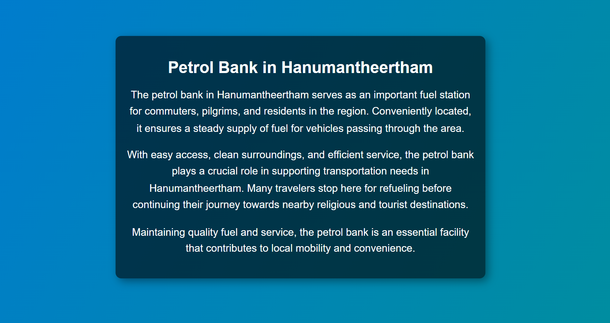

# Ex04 Places Around Me
# Date:28/04/2025
# AIM
To develop a website to display details about the places around my house.

# DESIGN STEPS
## STEP 1
Create a Django admin interface.

## STEP 2
Download your city map from Google.

## STEP 3
Using <map> tag name the map.

## STEP 4
Create clickable regions in the image using <area> tag.

## STEP 5
Write HTML programs for all the regions identified.

## STEP 6
Execute the programs and publish them.

# CODE
map.html
~~~~
<html>
<head>
  <title>My City</title>
</head>
<body>
  <h1 align="center">
    <b>my village</b>
  </h1>

  <h3 align="center">
    <b>VIGNESHWARAN.P(24900068)</b>
  </h3>

    
    <map name="MyCity">
      <area shape="rect" coords="700,250,850,400" href="map.html" title="Hanumantheertham">
      <area shape="circle" coords="570,230,45" href="river.html" title="Thenpennaiyar river">
      <area shape="circle" coords="640,200,30" href="petrol bank.html" title="Bharat petroleum">
      <area shape="circle" coords="1120,360,25" href="temple.html" title="hanuman temple">
      <area shape="rect" coords="950,120,1100,140" href="wedding hall.html" title="balusamy thirumana mahal">
    </map>
  

</body>
</html>
~~~~
temple.html
~~~~
<!DOCTYPE html>
<html lang="en">
<head>
    <meta charset="UTF-8">
    <meta name="viewport" content="width=device-width, initial-scale=1.0">
    <title>Hanumantheertham Temple</title>
    
</head>
<body>
    

        <h1>Hanumantheertham Temple</h1>
        
The Hanumantheertham Temple, located on the banks of the Thenpennai River, is a sacred site dedicated to Lord Hanuman. It is believed that Lord Hanuman himself performed penance here, making this temple highly revered among devotees.

        
The temple’s architecture reflects traditional South Indian styles, featuring beautifully carved sculptures and a serene atmosphere. Pilgrims visit to seek blessings, witness ancient rituals, and experience the spiritual energy that surrounds Hanumantheertham.

        
The temple becomes especially vibrant during religious festivals, attracting visitors from far and wide. The scenic beauty of the river beside the temple enhances the divine experience, making it a must-visit location for devotees and travelers alike.

    

</body>
</html>
~~~~
river.html
~~~~
<!DOCTYPE html>
<html lang="en">
<head>
    <meta charset="UTF-8">
    <meta name="viewport" content="width=device-width, initial-scale=1.0">
    <title>Thenpennai River - Hanumantheertham</title>
    
</head>
<body>
    

        <h1>Thenpennai River - Hanumantheertham</h1>
        
The Thenpennai River, also known as South Pennar, is an important river flowing through Tamil Nadu. At Hanumantheertham, this river is known for its serene beauty and religious significance. The area is believed to be associated with Lord Hanuman, making it a sacred pilgrimage site.

        
The river nourishes nearby agricultural lands and supports local biodiversity. Its calm waters and picturesque surroundings make Hanumantheertham an ideal spot for devotion and relaxation.

    

</body>
</html>
~~~~
wedding hall
~~~~
<!DOCTYPE html>
<html lang="en">
<head>
    <meta charset="UTF-8">
    <meta name="viewport" content="width=device-width, initial-scale=1.0">
    <title>Wedding Hall in Hanumantheertham</title>
    
</head>
<body>
    

        <h1>Wedding Hall in Hanumantheertham</h1>
        
The wedding hall in Hanumantheertham is a grand venue designed to host traditional weddings and ceremonies. Its spacious interiors, elegant décor, and modern amenities make it a preferred choice for celebrations.

        
Surrounded by serene landscapes and cultural richness, this wedding hall provides the perfect setting for sacred unions. Guests enjoy a warm and festive atmosphere, making every event memorable.

        
Equipped with catering, seating arrangements, and stage facilities, the venue ensures seamless wedding experiences that blend heritage with modern comforts.

    

</body>
</html>
~~~~
petrol bank.html
~~~~
<!DOCTYPE html>
<html lang="en">
<head>
    <meta charset="UTF-8">
    <meta name="viewport" content="width=device-width, initial-scale=1.0">
    <title>Petrol Bank in Hanumantheertham</title>
    
</head>
<body>
    

        <h1>Petrol Bank in Hanumantheertham</h1>
        
The petrol bank in Hanumantheertham serves as an important fuel station for commuters, pilgrims, and residents in the region. Conveniently located, it ensures a steady supply of fuel for vehicles passing through the area.

        
With easy access, clean surroundings, and efficient service, the petrol bank plays a crucial role in supporting transportation needs in Hanumantheertham. Many travelers stop here for refueling before continuing their journey towards nearby religious and tourist destinations.

        
Maintaining quality fuel and service, the petrol bank is an essential facility that contributes to local mobility and convenience.

    

</body>
</html>
~~~~
# OUTPUT

# RESULT
The program for implementing image maps using HTML is executed successfully.
